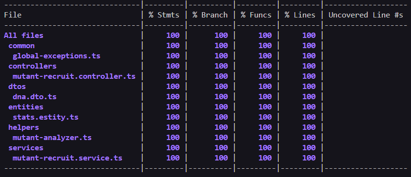

# Mutant Recruiter - MELI

## Descripcion

API que analiza una matriz de strings y en base a un patron determinado verifica si el ADN pertenece a una persona humana o a un mutante

## Autor

- [@rene-nicolas-palenque](https://www.linkedin.com/in/rene-nicolas-palenque/)


## Tech Stack

**Server:** NestJS

**Documentacion:** Swagger

**Base de datos:** SQLite

**Test unitarios:** Jest

## Iniciar proyecto localmente

Clonar proyecto

```bash
  git clone https://github.com/nicoopalenque/mutant-meli.git
```

Ir al directorio del proyecto

```bash
  cd mutant-meli
```

Instalar dependencias

```bash
  npm install
```

Iniciar el servidor

```bash
  npm run start:dev
```


## Test Unitarios

Para correr los test unitarios utilice el siguiente comando

```bash
  npm run test
```


## Coverage



## cURL para consumir desde postman

### DNA no mutante

```bash
  curl --location 'localhost:3000/mutant' \
  --header 'Content-Type: application/json' \
  --data '{
      "dna": [
              "ATGC",
              "CAGT",
              "TTAA",
              "AGCT"
          ]
  }'
```

### DNA mutante

```bash
  curl --location 'localhost:3000/mutant' \
  --header 'Content-Type: application/json' \
  --data '{
      "dna": [
            "ATGCGA",
            "CAGTGC",
            "TTATGT",
            "AGAAGG",
            "CCCCTA",
            "TCACTG"
        ]
  }'
```

### Check stats

```bash
  curl --location 'localhost:3000/stats'
```


